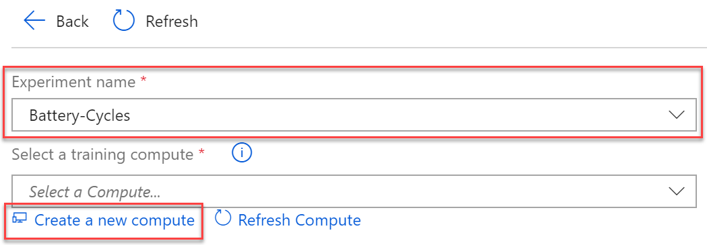
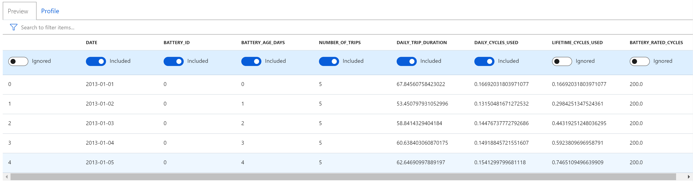
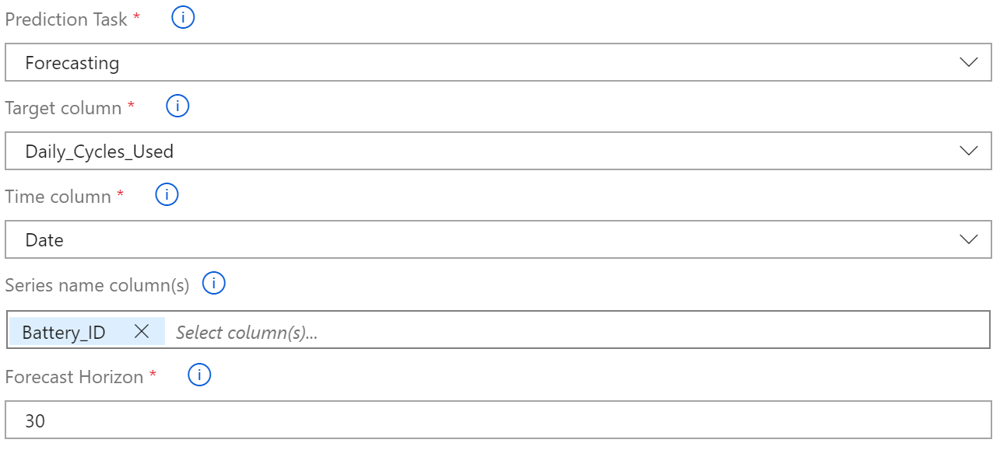
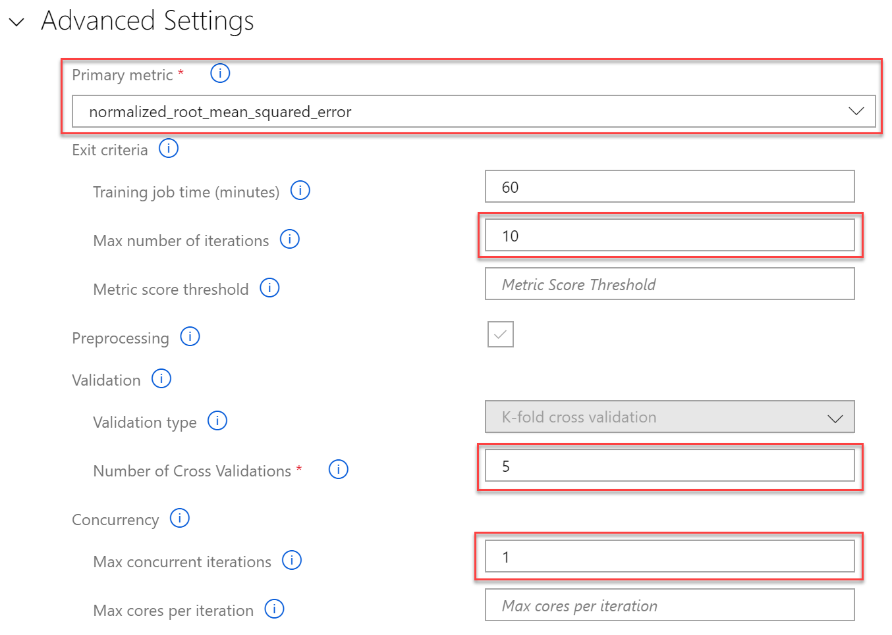
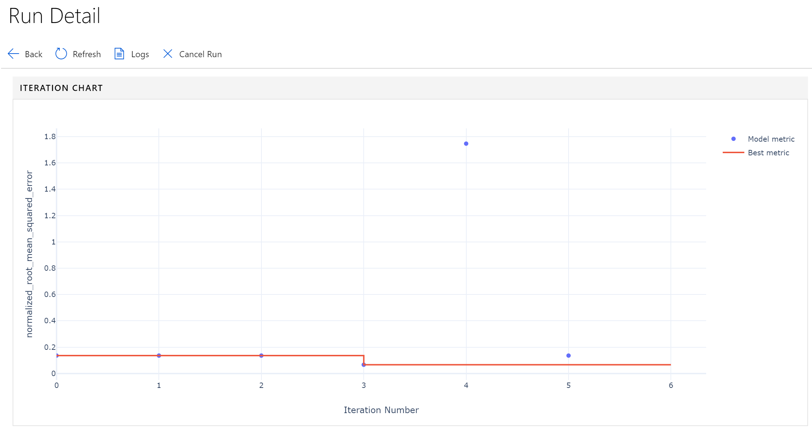
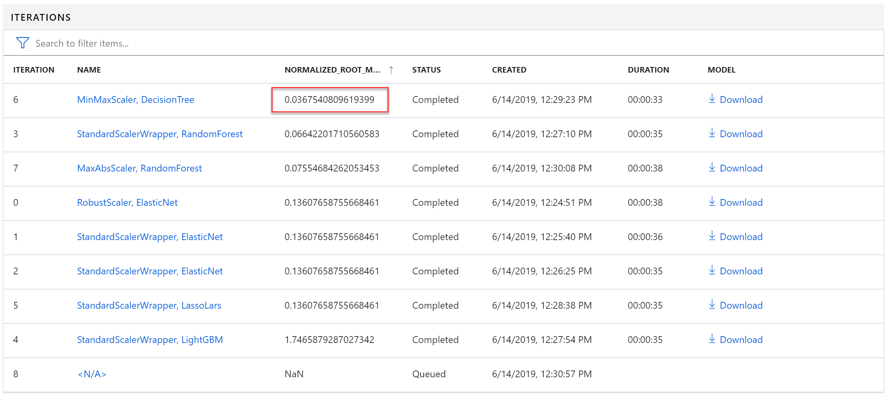
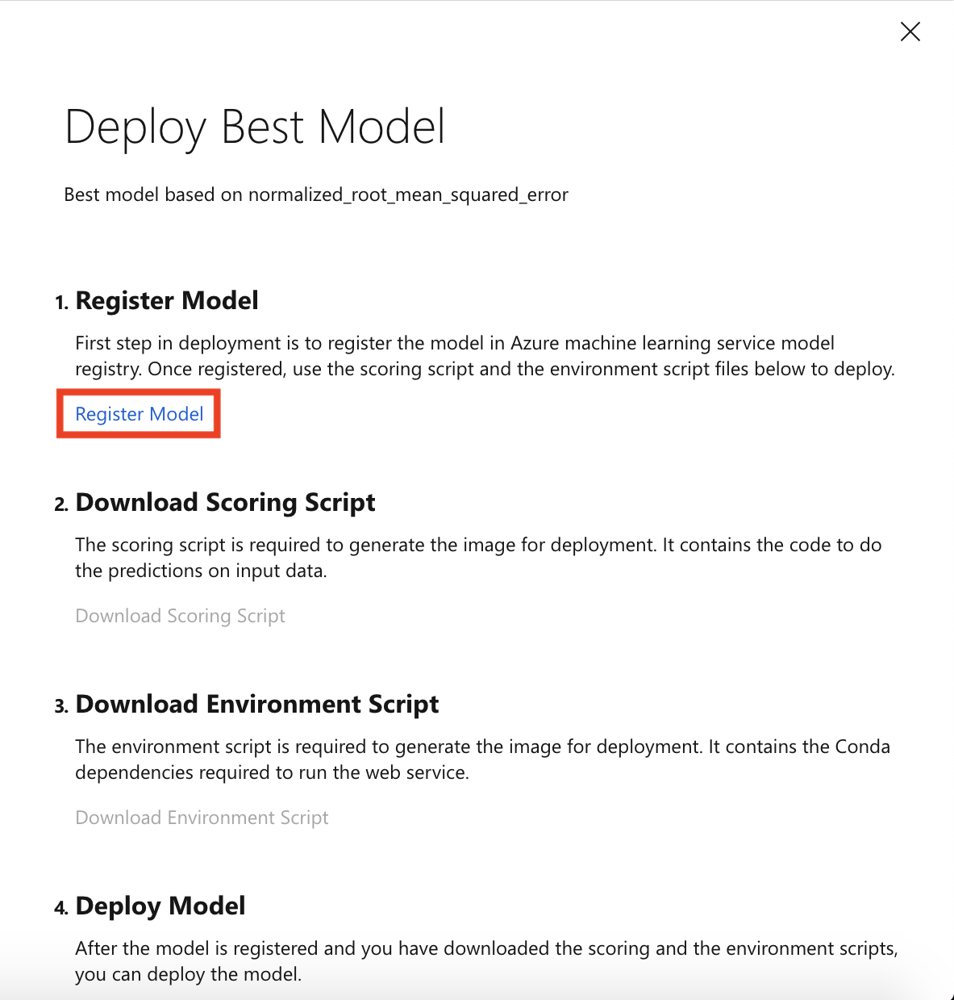
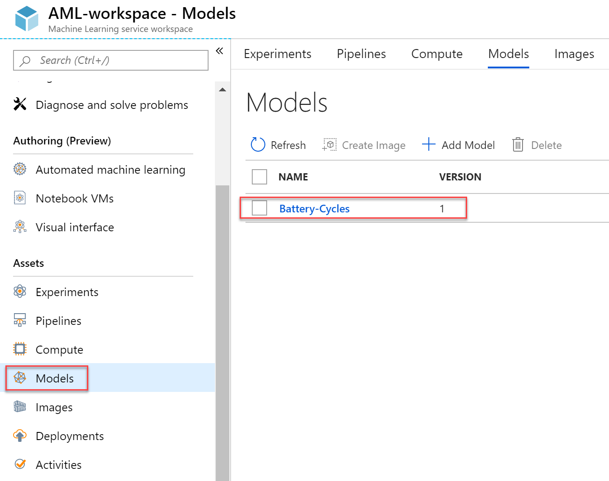

Machine Learning

Hands-on lab step-by-step

June 2019

Information in this document, including URL and other Internet Web site references, is subject to change without notice. Unless otherwise noted, the example companies, organizations, products, domain names, e-mail addresses, logos, people, places, and events depicted herein are fictitious, and no association with any real company, organization, product, domain name, e-mail address, logo, person, place or event is intended or should be inferred. Complying with all applicable copyright laws is the responsibility of the user. Without limiting the rights under copyright, no part of this document may be reproduced, stored in or introduced into a retrieval system, or transmitted in any form or by any means (electronic, mechanical, photocopying, recording, or otherwise), or for any purpose, without the express written permission of Microsoft Corporation.

Microsoft may have patents, patent applications, trademarks, copyrights, or other intellectual property rights covering subject matter in this document. Except as expressly provided in any written license agreement from Microsoft, the furnishing of this document does not give you any license to these patents, trademarks, copyrights, or other intellectual property.

The names of manufacturers, products, or URLs are provided for informational purposes only and Microsoft makes no representations and warranties, either expressed, implied, or statutory, regarding these manufacturers or the use of the products with any Microsoft technologies. The inclusion of a manufacturer or product does not imply endorsement of Microsoft of the manufacturer or product. Links may be provided to third party sites. Such sites are not under the control of Microsoft and Microsoft is not responsible for the contents of any linked site or any link contained in a linked site, or any changes or updates to such sites. Microsoft is not responsible for webcasting or any other form of transmission received from any linked site. Microsoft is providing these links to you only as a convenience, and the inclusion of any link does not imply endorsement of Microsoft of the site or the products contained therein.

© 2019 Microsoft Corporation. All rights reserved.

Microsoft and the trademarks listed at <https://www.microsoft.com/en-us/legal/intellectualproperty/Trademarks/Usage/General.aspx> are trademarks of the Microsoft group of companies. All other trademarks are property of their respective owners.

**Contents** 

<!-- TOC -->

- [Machine Learning hands-on lab step-by-step](#machine-learning-hands-on-lab-step-by-step)
  - [Abstract and learning objectives](#abstract-and-learning-objectives)
  - [Overview](#overview)
  - [Solution architecture](#solution-architecture)
  - [Requirements](#requirements)
  - [Before the hands-on lab](#before-the-hands-on-lab)
  - [Exercise 1: Creating a forecast model using automated machine learning](#exercise-1-creating-a-forecast-model-using-automated-machine-learning)
    - [Task 1: Create an automated machine learning experiment](#task-1-create-an-automated-machine-learning-experiment)
    - [Task 2: Review the experiment run results](#task-2-review-the-experiment-run-results)
    - [Task 3: Register the Best Model](#task-3-register-the-best-model)
  - [Exercise 2: Understanding the automated ML generated forecast model using model explainability](#exercise-2-understanding-the-automated-ml-generated-forecast-model-using-model-explainability)
    - [Task 1: Explore the model using a notebook](#task-1-explore-the-model-using-a-notebook)
  - [Exercise 3: Creating a deep learning model (RNN) for time series data and registering the model](#exercise-3-creating-a-deep-learning-model-rnn-for-time-series-data-and-registering-the-model)
    - [Task 1: Create the model using a notebook](#task-1-create-the-model-using-a-notebook)
  - [Exercise 4: Using a forecast model for scoring of streaming telemetry](#exercise-4-using-a-forecast-model-for-scoring-of-streaming-telemetry)
    - [Task 1: Create the streaming job using a notebook](#task-1-create-the-streaming-job-using-a-notebook)
  - [Exercise 5: Creating a deep learning text classification model](#exercise-5-creating-a-deep-learning-text-classification-model)
    - [Task 1: Create the classification model using a notebook](#task-1-create-the-classification-model-using-a-notebook)
  - [After the hands-on lab](#after-the-hands-on-lab)
    - [Task 1: Clean up lab resources](#task-1-clean-up-lab-resources)

<!-- /TOC -->

# Machine Learning hands-on lab step-by-step 

## Abstract and learning objectives 

In this lab, you will use Azure Databricks in combination with Azure Machine Learning service to build, train and deploy the desired models. You will learn:
  - How to train a forecasting model against time series data without any code by using automated machine learning.
  - How to create a recurrent neural network (RNN) model using PyTorch in Azure Databricks that can be used to forecast against time-series data.
  - How to use a trained forecast model to score data in real-time using Spark Structured Streaming within Azure Databricks.
  - How to train an Natural Language Processing text classification model using Keras.

## Overview

Trey Research Inc. delivers innovative solutions for manufacturers. They specialize in identifying and solving problems for manufacturers that can run the range from automating away mundane but time-intensive processes to delivering cutting edge approaches that provide new opportunities for their manufacturing clients. 

Trey Research is looking to provide the next generation experience for connected car manufacturers by enabling them to utilize AI to decide when to pro-actively reach out to the customer thru alerts delivered directly to the car's in-dash information and entertainment head unit. For their PoC, they would like to focus on two maintenance related scenarios.

In the first scenario, Trey Research recently instituted new regulations defining what parts are compliant or out of compliance. Rather than rely on their technicians to assess compliance, they would like to automatically assess the compliance based on component notes already entered by authorized technicians. Specifically they are looking to leverage Deep Learning technologies with Natural Language Processing techniques to scan through vehicle specification documents to find compliance issues with new regulations. Then each car is evaluated for out compliance components. 

In the second scenario, Trey Research would like to predict the likelihood of battery failure based on the telemetry stream of time series data that the car provides about how the battery performs when the car is started, how it is charging while running and how well it is holding its charge, among other factors. If they detect a battery failure is imminent within the next 30 days, they would like to send an alert.

Upon detection of an out of compliance component or a battery at risk of failure, they would like to be able to send an alert directly to the customer inviting them to schedule a service appointment to replace the part. 

In building this PoC, Trey Research wants to understand how they might use machine learning or deep learning in both scenarios, and standardize the platform that would support the data processing, model management and inferencing aspects of each. 

They are also interested to learn what new capabilities Azure provides that might help them to document and explain the models that are created to non-data scientists or might accelerate their time to creating production ready, performant models. 

In this lab, you will use Azure Databricks in combination with Azure Machine Learning service to build, train and deploy the desired models. 

## Solution architecture

The following diagram summarizes the key components and processing steps in the lab.

In this lab, models are trained using both Azure Databricks (for deep learning with the PyTorch and Keras frameworks) and Azure Machine Learning compute (for automated machine learning using the user experience in the Azure Portal). Models are registered with the Azure Machine Learning Workspace. The data used for model training is read from Azure Storage. 

The scoring is performed using notebooks running within Azure notebooks, which show how to load and apply the respective models against the data provided. 

## Requirements

1.  Microsoft Azure subscription must be pay-as-you-go or MSDN

    a. Trial subscriptions will not work. You will run into issues with Azure resource quota limits.

    b. Subscriptions with access limited to a single resource group will not work. You will need the ability to deploy multiple resource groups.

## Before the hands-on lab

Refer to the Before the hands-on lab setup guide manual before continuing to the lab exercises.

## Exercise 1: Creating a forecast model using automated machine learning

Duration: 30 minutes

In this exercise, you will create a model that predicts battery failure from time-series data using the visual interface to automated machine learning in an Azure Machine Learning workspace. 

### Task 1: Create an automated machine learning experiment

1. Navigate to your Azure Machine Learning workspace in the Azure Portal.
2. Select `Automated machine learning` in the left navigation bar.
3. Select  **Create Experiment**.
   
   

4. Provide the experiment name: `Battery-Cycles` and select **Create a new compute**.
   
   

5. For the new compute, provide the following values and then select **Create**:
   - Compute name: `auto-ml-compute`
   - VM size: `STANDARD_DS11_V2`
   - Select `Additional Settings` and set Minimum number of nodes and Maximum number of nodes to `1`.
   
      

6. Wait for the Compute to be ready and select **Next**. Now you will upload the training data. Start by downloading the data from https://databricksdemostore.blob.core.windows.net/data/connected-car/daily-battery-time-series.csv. Select **Upload** and then in the dialog that appears choose the file `daily-battery-time-series.csv` from your local disk.
   
   

7. Select **daily-battery-time-series.csv** and review the training data. Be sure to scroll to the right to observe the target column `Daily_Cycles_Used`. Toggle the switch above the following columns so the header reads `Ignored` for the first unlabeled column, `number_of_trips`, `lifetime_cycles_used` and `battery_rated_cycles` columns.
   
   

8. Now, you will setup the Auto ML Experiment Basic Settings by providing the following values:
   - Prediction Task: select **Forecasting**
   - Target column: select **Daily_Cycles_Used**
   - Time column: select **Date**
   - Series name column(s): **Battery_ID**
   - Forecast Horizon: enter `30`. This refers to forecasting out up to 30 days. 

      

9. Select **Advanced Settings** to expand that area. Provide the following settings:
   - Primary metric: **normalized_root-mean_squared_error**
   - Max number of iterations: **10**
   - Number of Cross Validations: **5**
   - Max concurrent iterations: **1**
   
     

10. Select **Start** to run the experiment and begin automated machine learning process.
    
### Task 2: Review the experiment run results

1. The experiment will run for about *5-10 minutes*. Once it completes you should examine the chart to observe the model performance for the primary metric for different iterations. 
   
   

2. Scroll down to see a table view of different iterations and select the iteration with the best **normalized root mean square error** score. Note that the normalized root mean square error measures the error between the predicted value and actual value. In this case, the model with the lowest normalized root mean square error is the best model.
   
   

### Task 3: Register the Best Model
1. Return to the top of the `Run Details` screen and select **Deploy Best Model** as shown. Note that deployment consists of four steps: (1) *Register Best Model*, (2) Download *Scoring and Environment Script files*, (3) Create *Deployment Image* using the downloaded script files, and (4) Deploy *Scoring Web Service* using the created image.
   
   

2. You register the best model with the Azure Machine Learning service model registry so that you can retrieve it later when you want to use it for scoring. Select **Register Model** link. Once the registration process has completed, the link will change to the text `Model has been registered`.
   
   

3. The model registration, will create a new model in your Azure Machine Learning workspace with the same name as the experiment: `Battery-Cycles`. To view this model from the Azure Machine Learning workspace, select **Models**. 
   
   

4. If you see your model in the above list, you are now ready to continue on to the next exercise.

## Exercise 2: Understanding the automated ML generated forecast model using model explainability 

Duration: 15 minutes

### Task 1: Explore the model using a notebook

1. Browse to your Azure Databricks Workspace and open `AI with Databricks and AML \ Model Explainability`. This is the notebook you will step thru executing in this lab.
2. Follow the instructions within the notebook to complete the lab.

## Exercise 3: Creating a deep learning model (RNN) for time series data and registering the model

Duration: 45 minutes

### Task 1: Create the model using a notebook

1. Browse to your Azure Databricks Workspace and open `AI with Databricks and AML \ Deep Learning with Time Series`. This is the notebook you will step thru executing in this lab.
2. Follow the instructions within the notebook to complete the lab.

## Exercise 4: Using a forecast model for scoring of streaming telemetry

Duration: 45 minutes

In this exercise, you will apply the forecast model to a Spark streaming job in order to make predictions against streaming data.

### Task 1: Create the streaming job using a notebook

1. Browse to your Azure Databricks Workspace and navigate to `AI with Databricks and AML \ Stream Scoring`. This is the notebook you will step thru executing in this lab.
2. Follow the instructions within the notebook to complete the lab.

## Exercise 5: Creating a deep learning text classification model

Duration: 45 minutes

In this exercise, you create a model for classifying component text as compliant or non-compliant.

### Task 1: Create the classification model using a notebook

1. Browse to your Azure Databricks Workspace and navigate to `AI with Databricks and AML \ Deep Learning with Text`. This is the notebook you will step thru executing in this lab.
2. Follow the instructions within the notebook to complete the lab.

## After the hands-on lab 

Duration: 5 minutes

To avoid unexpected charges, it is recommended that you clean up all of your lab resources when you complete the lab.

### Task 1: Clean up lab resources

1.  Navigate to the Azure Portal and locate the `MCW-AI-Lab` Resource Group you created for this lab.

2.  Select **Delete resource group** from the command bar.

    

3.  In the confirmation dialog that appears, enter the name of the resource group and select **Delete**.

4.  Wait for the confirmation that the Resource Group has been successfully deleted. If you don't wait, and the delete fails for some reason, you may be left with resources running that were not expected. You can monitor using the Notifications dialog, which is accessible from the Alarm icon.

    

5.  When the Notification indicates success, the cleanup is complete.

    

You should follow all steps provided _after_ attending the Hands-on lab.

