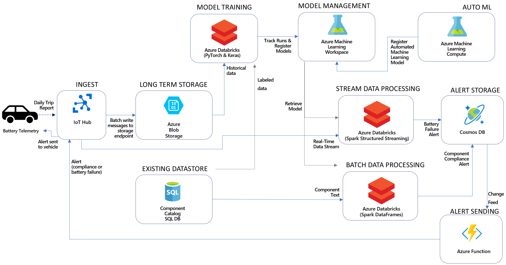

AI with Databricks and Azure Machine Learning

Whiteboard design session trainer guide

June 2019

Information in this document, including URL and other Internet Web site references, is subject to change without notice. Unless otherwise noted, the example companies, organizations, products, domain names, e-mail addresses, logos, people, places, and events depicted herein are fictitious, and no association with any real company, organization, product, domain name, e-mail address, logo, person, place or event is intended or should be inferred. Complying with all applicable copyright laws is the responsibility of the user. Without limiting the rights under copyright, no part of this document may be reproduced, stored in or introduced into a retrieval system, or transmitted in any form or by any means (electronic, mechanical, photocopying, recording, or otherwise), or for any purpose, without the express written permission of Microsoft Corporation.

Microsoft may have patents, patent applications, trademarks, copyrights, or other intellectual property rights covering subject matter in this document. Except as expressly provided in any written license agreement from Microsoft, the furnishing of this document does not give you any license to these patents, trademarks, copyrights, or other intellectual property.

The names of manufacturers, products, or URLs are provided for informational purposes only and Microsoft makes no representations and warranties, either expressed, implied, or statutory, regarding these manufacturers or the use of the products with any Microsoft technologies. The inclusion of a manufacturer or product does not imply endorsement of Microsoft of the manufacturer or product. Links may be provided to third party sites. Such sites are not under the control of Microsoft and Microsoft is not responsible for the contents of any linked site or any link contained in a linked site, or any changes or updates to such sites. Microsoft is not responsible for webcasting or any other form of transmission received from any linked site. Microsoft is providing these links to you only as a convenience, and the inclusion of any link does not imply endorsement of Microsoft of the site or the products contained therein.

© 2019 Microsoft Corporation. All rights reserved.

Microsoft and the trademarks listed at <https://www.microsoft.com/en-us/legal/intellectualproperty/Trademarks/Usage/General.aspx> are trademarks of the Microsoft group of companies. All other trademarks are property of their respective owners.

**Contents**

<!-- TOC -->

- [Trainer information](#trainer-information)
  - [Role of the trainer](#role-of-the-trainer)
  - [Whiteboard design session flow](#whiteboard-design-session-flow)
  - [Before the whiteboard design session: How to prepare](#before-the-whiteboard-design-session-how-to-prepare)
  - [During the whiteboard design session: Tips for an effective whiteboard design session](#during-the-whiteboard-design-session-tips-for-an-effective-whiteboard-design-session)
- [AI with Databricks and Azure Machine Learning whiteboard design session student guide](#ai-with-databricks-and-azure-machine-learning-whiteboard-design-session-student-guide)
  - [Abstract and learning objectives](#abstract-and-learning-objectives)
  - [Step 1: Review the customer case study](#step-1-review-the-customer-case-study)
    - [Customer situation](#customer-situation)
    - [Customer needs](#customer-needs)
    - [Customer objections](#customer-objections)
    - [Infographic for common scenarios](#infographic-for-common-scenarios)
  - [Step 2: Design a proof of concept solution](#step-2-design-a-proof-of-concept-solution)
  - [Step 3: Present the solution](#step-3-present-the-solution)
  - [Wrap-up](#wrap-up)
  - [Additional references](#additional-references)
- [AI with Databricks and Azure Machine Learning whiteboard design session trainer guide](#ai-with-databricks-and-azure-machine-learning-whiteboard-design-session-trainer-guide)
  - [Step 1: Review the customer case study](#step-1-review-the-customer-case-study-1)
  - [Step 2: Design a proof of concept solution](#step-2-design-a-proof-of-concept-solution-1)
  - [Step 3: Present the solution](#step-3-present-the-solution-1)
  - [Wrap-up](#wrap-up-1)
  - [Preferred target audience](#preferred-target-audience)
  - [Preferred solution](#preferred-solution)
  - [Checklist of preferred objection handling](#checklist-of-preferred-objection-handling)
  - [Customer quote (to be read back to the attendees at the end)](#customer-quote-to-be-read-back-to-the-attendees-at-the-end)

<!-- /TOC -->

# Trainer information

Thank you for taking time to support the whiteboard design sessions as a trainer!

## Role of the trainer

An amazing trainer:

-   Creates a safe environment in which learning can take place.

-   Stimulates the participant's thinking.

-   Involves the participant in the learning process.

-   Manages the learning process (on time, on topic, and adjusting to benefit participants).

-   Ensures individual participant accountability.

-   Ties it all together for the participant.

-   Provides insight and experience to the learning process.

-   Effectively leads the whiteboard design session discussion.

-   Monitors quality and appropriateness of participant deliverables.

-   Effectively leads the feedback process.

## Whiteboard design session flow 

Each whiteboard design session uses the following flow:

**Step 1: Review the customer case study (15 minutes)**

**Outcome**

Analyze your customer's needs.

-   Customer's background, situation, needs and technical requirements

-   Current customer infrastructure and architecture

-   Potential issues, objectives and blockers

**Step 2: Design a proof of concept solution (60 minutes)**

**Outcome**

Design a solution and prepare to present the solution to the target customer audience in a 15-minute chalk-talk format.

-   Determine your target customer audience.

-   Determine customer's business needs to address your solution.

-   Design and diagram your solution.

-   Prepare to present your solution.

**Step 3: Present the solution (30 minutes)**

**Outcome**

Present solution to your customer:

-   Present solution

-   Respond to customer objections

-   Receive feedback

**Wrap-up (15 minutes)**

-   Review preferred solution

## Before the whiteboard design session: How to prepare

Before conducting your first whiteboard design session:

-   Read the Student guide (including the case study) and Trainer guide.

-   Become familiar with all key points and activities.

-   Plan the point you want to stress, which questions you want to drive, transitions, and be ready to answer questions.

-   Prior to the whiteboard design session, discuss the case study to pick up more ideas.

-   Make notes for later.

## During the whiteboard design session: Tips for an effective whiteboard design session

**Refer to the Trainer guide** to stay on track and observe the timings.

**Do not expect to memorize every detail** of the whiteboard design session.

When participants are doing activities, you can **look ahead to refresh your memory**.

-   **Adjust activity and whiteboard design session pace** as needed to allow time for presenting, feedback, and sharing.

-   **Add examples, points, and stories** from your own experience. Think about stories you can share that help you make your points clearly and effectively.

-   **Consider creating a "parking lot"** to record issues or questions raised that are outside the scope of the whiteboard design session or can be answered later. Decide how you will address these issues, so you can acknowledge them without being derailed by them.

***Have fun**! Encourage participants to have fun and share!*

**Involve your participants.** Talk and share your knowledge but always involve your participants, even while you are the one speaking.

**Ask questions** and get them to share to fully involve your group in the learning process.

**Ask first**, whenever possible. Before launching into a topic, learn your audience's opinions about it and experiences with it. Asking first enables you to assess their level of knowledge and experience, and leaves them more open to what you are presenting.

**Wait for responses**. If you ask a question such as, "What's your experience with (fill in the blank)?" then wait. Do not be afraid of a little silence. If you leap into the silence, your participants will feel you are not serious about involving them and will become passive. Give participants a chance to think, and if no one answers, patiently ask again. You will usually get a response.

#  AI with Databricks and Azure Machine Learning whiteboard design session student guide

## Abstract and learning objectives 

In this whiteboard design session, you will work with a group to design a solution that combines Azure Databricks with Azure Machine Learning to build, train and deploy the machine learning and deep learning models. You will learn:
- Use of automated machine learning and understanding of its capabilities 
- Use of model explainability features
- Model lifecycle management from training in Azure Databricks to deployment for use in batch and real-time inferencing scenarios
- Deep learning models for NLP in text classification and forecasting against time-series data
- To compare PyTorch and Keras for deep learning

At the end of this whiteboard design session, you will be better able to design solutions leveraging the Azure Machine Learning service and Azure Databricks.

## Step 1: Review the customer case study 

**Outcome**

Analyze your customer's needs.

Timeframe: 15 minutes

Directions:  With all participants in the session, the facilitator/SME presents an overview of the customer case study along with technical tips.

1.  Meet your table participants and trainer.

2.  Read all of the directions for steps 1-3 in the student guide.

3.  As a table team, review the following customer case study.

### Customer situation

Trey Research Inc. delivers innovative solutions for manufacturers. They specialize in identifying and solving problems for manufacturers that can run the range from automating away mundane but time-intensive processes to delivering cutting edge approaches that provide new opportunities for their manufacturing clients. 

According to Francine Fischer, CIO of Trey Research, Trey Research is looking to provide the next generation experience for connected car manufacturers by enabling them to utilize AI to decide when to pro-actively reach out to the customer thru alerts delivered directly to the car's in-dash information and entertainment head unit. For their PoC, they would like to focus on two maintenance related scenarios.

In the first scenario, Trey Research recently instituted new regulations defining what parts are compliant or out of compliance. Rather than rely on their technicians to assess compliance, they would like to automatically assess the compliance based on component notes already entered by authorized technicians. Specifically they are looking to leverage Deep Learning technologies with Natural Language Processing techniques to scan through vehicle specification documents to find compliance issues with new regulations. They envision that with an approach like this to detect out of compliance parts, they can then process all of the components of each car (according to the specifications) to identify if any compliance issues should be flagged with the customer. 

Each document in the component data has a short text description of the component as documented by an authorized technician. 
The contents include:
- Manufacture year of the component (e.g. 1985, 2010)
- Condition of the component (poor, fair, good, new)
- Materials used in the component (plastic, carbon fiber, steel, iron)

The compliance regulations dictate:
*Any component manufactured before 1995 or in fair or poor condition or made with plastic or iron is out of compliance.*

For example:
* Manufactured in 1985 made of steel in fair condition -> **Non-compliant**
* Good condition carbon fiber component manufactured in 2010 -> **Compliant**
* Steel component manufactured in 1995 in fair condition -> **Non-Compliant**

The labels present in this data are 0 for compliant, 1 for non-compliant. Trey has already provisioned an Azure SQL Database containing their entire catalog of component descriptions, as well as labelled component data they expect to use in training the model.

In the second scenario, Trey Research would like to predict the likelihood of battery failure based on the telemetry stream of time series data that the car provides about how the battery performs when the car is started, how it is charging while running and how well it is holding its charge, among other factors. If they detect a battery failure is imminent within the next 30 days, they would like to send an alert.

With regards to the battery telemetry, the subject matter experts at Trey have explained that batteries are manufactured to a specification indicating how many cycles (that is complete charge, discharge cycles) they can handle before their performance starts to degrade (which indicates a good point to suggest replacing the battery). Effectively, the daily cycles consumed is like a clock counting up towards battery's rated lifecycle, approximating the battery's lifespan. In their solution, they can collect telemetry from a car on a daily basis, collecting data about the duration (in minutes) of the trips the car took during the previous day. For their prototype, they have provided historical data for batteries that have reached their replacement point. For a single battery, the telemetry looks similar to the following:

| Date	| Battery_ID	| Battery_Age_Days	| Number_Of_Trips	| Daily_Trip_Duration	| Daily_Cycles_Used	| Lifetime_Cycles_Used	| Battery_Rated_Cycles |
| --- | --- | --- | --- | --- | --- | --- | --- |
| 1/1/2013	| 0	| 0	| 5	| 67.84560758	| 0.166920318	| 0.166920318	| 200
| 1/2/2013	| 0	| 1	| 5	| 53.45079793	| 0.131504817	| 0.298425135	| 200
| 1/3/2013	| 0	| 2	| 5	| 58.84143294	| 0.144767378	| 0.443192512	| 200
| 1/4/2013	| 0	| 3	| 5	| 60.63840306	| 0.149188457	| 0.59238097	| 200
| 1/5/2013	| 0	| 4	| 5	| 62.64690998	| 0.15412998	| 0.74651095	| 200

Upon detection of an out of compliance component or a battery at risk of failure, they would like to be able to send an alert directly to the customer inviting them to schedule a service appointment to replace the part. 

In building this PoC, Trey Research wants to understand how they might use machine learning or deep learning in both scenarios, and standardize the platform that would support the data processing, model management and inferencing aspects of each. 

They are also interested to learn what new capabilities Azure provides that might help them to document and explain the models that are created to non-data scientists or might accelerate their time to creating production ready, performant models. 

Finally, they would like to be able to easily create dashboards that summarize the alerts generated so they can observe the solution in operation. 

### Customer needs 

1.  We would like to minimize the number of distinct technologies we need to apply across the data science process, from data collection, exploratory data analysis, data preparation, model training, model management and model deployment. How can Azure help us in this?

2.  Our board is concerned about the liability of not being able to justify and explain the function of the models we create. We recognize many models are not easily explained in layman's terms, but how can we go about documenting how our models make predictions generally or how why they made specific predictions for particular input?

3.  Understand how they should create the NLP based model for compliance and the battery life-span forecasting model. 

4.  Know the data pipeline they need to build in Azure, from ingesting telemetry, to storing both the compliance text and battery telemetry, to visualizing the result.

### Customer objections 

1.  Should we use machine learning or deep learning approaches? 

2.  How should we choose between Keras and PyTorch for performing deep learning?

3.  We have heard Azure Machine Learning supports automated machine learning, can we use automated machine learning to create models using deep learning? Can we really expect a non-data scientist to create performant models using these tools?  

4.  Some of our team has worked with Azure Databricks, and they are confused by the overlap with Azure Machine Learning service. How should we be thinking about when to use which? 

### Infographic for common scenarios

**Azure Machine Learning taxonomy**

**Real-time analytics**

## Step 2: Design a proof of concept solution

**Outcome**

Design a solution and prepare to present the solution to the target customer audience in a 15-minute chalk-talk format.

Timeframe: 60 minutes

**Business needs**

Directions: With all participants at your table, answer the following questions and list the answers on a flip chart:

1.  Who should you present this solution to? Who is your target customer audience? Who are the decision makers?

2.  What customer business needs do you need to address with your solution?

**Design**

Directions: With all participants at your table, respond to the following questions on a flip chart:

_High-level architecture_

1.  Without getting into the details (the following sections will address the details), diagram your initial vision for the solution. You will refine this diagram as you proceed.

_Classifying component descriptions text data_

1.  What is the general pipeline for approaching the training of text analytic models such as this? What are the general steps you need to take to prepare the text data for performing tasks like classification?

2.  What data would they need to train the model? 

3.  How would Trey create a deep learning model to classify the component descriptions? Give an example of the architecture of the neural network.

4.  Describe how Trey would use the model in the context of batch scoring the component text for compliance? What services and frameworks would you suggest? 

_Forecasting battery failure_

1.  At a high level, describe the steps to apply a forecasting model to predict battery failure pending within the next 30 days.

2.  With regards to the model, what options does Trey have for creating the model against the time series data? Should they create a regression model, a forecasting model or a classifier? Why?

3.  Can this model be built using machine learning or does it require deep learning?

4.  If you were to suggest a deep learning model for forecasting against the time-series data, what architecture of neural network would you consider using first?

5.  Describe how Trey would use the model in the context of scoring the streaming telemetry? What services and frameworks would you suggest?

_Automated machine learning_

1.  For which scenario could Trey apply automated machine learning? Why? 

2.  How could they use automated machine learning with Azure Databricks?

_Model Management_

1.  For both models, how should Trey track the performance of each of their training runs?

2.  Can they quickly view this experiment data somewhere? Are there programmatic options to querying this data?

3.  How would they manage versioning of each the models they have created and associate these models with the results of evaluating their performance?

4.  In your solution, how will Trey retrieve previous versions of models and use them for further evaluation or scoring?

_Model Explainability & Reproducibility_

1.  How would you suggest Trey programmatically create explanations of their models? What is the process? Explain how it works to improve the interpretability of the model generally as well as for the results of specific predictions.

2.  Is the approach you suggest limited to working against machine learning models only (e.g., it does not work against deep learning models)?

3.  Does your approach support explaining models created with automated machine learning?

4.  How do machine learning pipelines help improve the reproducibility of model training and scoring? How could your solution leverage pipelines?

_Enabling visualization_

1.  During model training and evaluation, what services and libraries would you recommend that Trey utilize for visualizing the data and performance results?

2.  Would the approach you suggest extend to visualizing the streaming battery data?

3.  What should Trey utilize for providing easy to customize visualizations to business analysts and stakeholders? Is it the same or different tool you suggested they use during modeling? 

**Prepare**

Directions: With all participants at your table:

1.  Identify any customer needs that are not addressed with the proposed solution.

2.  Identify the benefits of your solution.

3.  Determine how you will respond to the customer's objections.

Prepare a 15-minute chalk-talk style presentation to the customer.

## Step 3: Present the solution

**Outcome**

Present a solution to the target customer audience in a 15-minute chalk-talk format.

Timeframe: 30 minutes

**Presentation**

Directions:

1.  Pair with another table.

2.  One table is the Microsoft team and the other table is the customer.

3.  The Microsoft team presents their proposed solution to the customer.

4.  The customer makes one of the objections from the list of objections.

5.  The Microsoft team responds to the objection.

6.  The customer team gives feedback to the Microsoft team.

7.  Tables switch roles and repeat Steps 2-6.

##  Wrap-up 

Timeframe: 15 minutes

Directions: Tables reconvene with the larger group to hear the facilitator/SME share the preferred solution for the case study.

##  Additional references

|    |            |
|----------|:-------------:|
| **Description** | **Links** |
|Azure Databricks documentation |https://docs.microsoft.com/en-us/azure/azure-databricks/|
|Azure Machine Learning documentation|https://docs.microsoft.com/en-us/azure/machine-learning/service/|
|PyTorch|https://pytorch.org|
|Keras|https://keras.io/|

# AI with Databricks and Azure Machine Learning whiteboard design session trainer guide

## Step 1: Review the customer case study

-   Check in with your table participants to introduce yourself as the trainer.

-   Ask, "What questions do you have about the customer case study?"

-   Briefly review the steps and timeframes of the whiteboard design session.

-   Ready, set, go! Let the table participants begin.

## Step 2: Design a proof of concept solution

-   Check in with your tables to ensure that they are transitioning from step to step on time.

-   Provide some feedback on their responses to the business needs and design.

    -   Try asking questions first that will lead the participants to discover the answers on their own.

-   Provide feedback for their responses to the customer's objections.

    -   Try asking questions first that will lead the participants to discover the answers on their own.

## Step 3: Present the solution

-   Determine which table will be paired with your table before Step 3 begins.

-   For the first round, assign one table as the presenting team and the other table as the customer.

-   Have the presenting team present their solution to the customer team.

    -   Have the customer team provide one objection for the presenting team to respond to.

    -   The presentation, objections, and feedback should take no longer than 15 minutes.

    -   If needed, the trainer may also provide feedback.

## Wrap-up

-   Have the table participants reconvene with the larger session group to hear the facilitator/SME share the following preferred solution.

##  Preferred target audience

Francine Fischer, CIO of Trey Research

The primary audience is the business decision makers and technology decision makers. From the case study scenario, this would include the Director of Analytics. Usually we talk to the infrastructure managers, who report to the chief information officers (CIOs), or to application sponsors (like a vice president [VP] line of business [LOB], or chief marketing officer [CMO]), or to those that represent the business unit IT or developers that report to application sponsors.

## Preferred solution

_High-level architecture_

1.  Without getting into the details (the following sections will address the details), diagram your initial vision for the solution. You will refine this diagram as you proceed.

The high level architecture of the solution is illustrated in the following diagram.

In the solution the component text data is retrieved from the existing Azure SQL Database store. The labeled data provided is used within Azure Databricks to train a model that can classify the components as compliant or non-compliant. During model training, the model logs and performance metrics are collected by Azure Machine Learning into the Workspace. The model that is created is also registered there so that it can be easily retrieved and used for later evaluation or scoring. Trey can score the component descriptions in batch using Azure Databricks, where by their notebook code retrieves the trained compliance model from the Azure Machine Learning Workspace. During this process they can evaluate vehicle by vehicle and issue an alert if any vehicle has been detected with out of compliance components. An alert is issued by inserting a new document into an a Cosmos DB collection. An Azure Function monitors the Cosmos DB change feed and creates a new cloud to device message to send to the vehicle via IoT Hub. Service facilities, who would not receive these pushed alerts, would be able to lookup the the alerts by querying from Cosmos DB. 

The process for the battery failure alerting works similarly. Trey would start by storing the historical data already have in Azure Storage blobs. This historical data would be used to train the model in Azure Databricks and register it with Azure Machine Learning. With trained model in hand, Trey could load create a notebook in Azure Databricks that uses Spark Structured Streaming to apply the model, make its forecasts and issue any alerts by writing documents to Cosmos DB for batteries forecasted to fail within 30 days. The data scored in this case would be the daily trip telemetry received from the vehicle, ingested into IoT Hub and directly read from by the Structured Streaming query. Additionally, Trey would want to archive all of the telemetry received via IoT Hub to Azure Storage blobs for the purposes of collecting historical data they can later use to improve their models and create new ones. The issued alerts would be queried or sent in the same way as described for component compliance alerts. 

_Classifying component descriptions text data_

1.  What is the general pipeline for approaching the training of text analytic models such as this? What are the general steps you need to take to prepare the text data for performing tasks like classification?

The core task in natural language processing (NLP) text pipelines is data preparation to express the textual data as numeric vectors by using word embeddings. The general pipeline begins by pre-processing or normalizing the text. This step typically includes tasks such as breaking the text into sentence and word tokens, standardizing the spelling of words, and removing overly common words (called stop words). The output of this phase is typically a multi-dimensional array consisting of an array of documents, each having an array of sentences, with each sentence having its own array of words. The next step is feature extraction, which creates a numeric representation of the textual documents. During feature extraction, a "vocabulary" of unique words is identified, and each word becomes a column in the output. Each row represents a document. The value in each cell is typically a measure of the relative importance of that word in the document, where if a word from the vocabulary does not appear, then that cell has a zero value in that column. This approach enables machine learning algorithms, which operate against arrays of numbers, to also operate against text. Deep learning algorithms operate on tensors, which are also vectors (or arrays of numbers), so this approach is also valid for preparing text for use with a deep learning algorithm. 

2.  What data would they need to train the model? 

Trey would need labeled examples consisting of the component text description and the label (0 for non-compliant, 1 for compliant).

3.  How would Trey create a deep learning model to classify the component descriptions? Give an example of the architecture of the neural network.

Trey would author a notebook that loads the labeled component description data and creates the word embeddings representation of data. They could start with a simple sequential neural network consisting of an input layer (one neuron for each "word"), a fully connected layer consisting of significantly fewer neurons than embeddings with a non-linear activation function (such as ReLu), followed by a fully connected layer consisting of a single neuron with an activation function (such as Sigmoid). Only after performing hyper-parameter tuning or iterating on how the prepare the data, would they likely consider a more complex network architecture like an a recurrent neural network (RNN). 

4.  Describe how Trey would use the model in the context of batch scoring the component text for compliance? What services and frameworks would you suggest? 

Because the combination of components and vehicles yields a potentially large number of data points they will want to score, Trey should consider using Azure Databricks and Spark to perform the scaling since it would support scoring the large dataset. 

_Forecasting battery failure_

1.  At a high level, describe the steps to apply a forecasting model to predict battery failure pending within the next 30 days.

In a forecasting scenario, time-stamped data is provided and the goal is to be able to forecast a value a certain number of periods in the future by looking at historical data. In Trey's case, they could use their existing daily battery telemetry to train a model that forecast the battery cycles used in any given day, for 30 days out. They would sum the battery cycles used from the historical data plus the forecast data and if the result exceeds the expected battery life they could predict this as a pending failure. 

2.  With regards to the model, what options does Trey have for creating the model against the time series data? Should they create a regression model, a forecasting model or a classifier? Why?

When forecasting against time-series data Trey should pick a forecasting model so as to take advantage of the temporal signals in the data. While a regression could work in this scenario, it is not common practice to use a regression when time series data is available. 

3.  Can this model be built using machine learning or does it require deep learning?

This model can be built using forecasting techniques from either machine learning or deep learning.

4.  If you were to suggest a deep learning model for forecasting against the time-series data, what architecture of neural network would you consider using first?

Generally, when forecasting against time-series data the predictions desired should be informed by all the historical data, but place more emphasis on more recent data. Recurrent Neural Networks (RNN's) provide such capability, and that is why they are frequently the first neural network architecture attempted with time-series data.

5.  Describe how Trey would use the model in the context of scoring the streaming telemetry? What services and frameworks would you suggest?

Trey should use the model within notebooks running in Azure Databricks, and apply the model using Spark Streaming to forecast results on micro-batches of battery telemetry as they arrive.  

_Automated machine learning_

1.  For which scenario could Trey apply automated machine learning? Why? 

While automated machine learning could be applied to both scenarios, the significant additional data preparation required for text classification means that automated machine learning could not be applied outright. However, for the the time-series battery lifecycle data they could directly use the automated machine learning capabilities of Azure Machine Learning to create a forecast model. 

2.  How could they use automated machine learning with Azure Databricks?

Trey has two options for leveraging automated machine learning: 
- They could train the model with the user experience that is available from the Azure Machine Learning workspace in the Azure Portal, and then register the trained model with the workspace.
- They could train the model using automated machine learning via the Azure Machine Learning Python SDK within a Databricks notebooks, and then register the model that results.
With the registered model available, any notebooks they would build that use the model for scoring would retrieve the model from the Azure Machine Learning registry using the Azure Machine Learning Python SDK.

_Model Management_

1.  For both models, how should Trey track the performance of each of their training runs?

Within their notebooks that perform model training, Trey should be using the Azure Machine Learning Python SDK to create an experiment for session. Within this experiment they can create a run each time they train the model and capture logs, the training time taken and any performance metrics that result from the model evaluation. 

2.  Can they quickly view this experiment data somewhere? Are there programmatic options to querying this data?

Once the data is for an experiment is collected in the Azure Machine Learning workspace, Trey can view it from the Experiments tab of the Azure Portal. From here they can drill into each run and explore the run details. Using the Azure Machine Learning Python SDK from a notebook, Trey can retrieve all of the experiments and run details and evaluate them programmatically (for example to pick the best run according to some custom logic).

3.  How would they manage versioning of each the models they have created and associate these models with the results of evaluating their performance?

When they complete a training run for a model they would like to keep, Trey can use the Azure Machine Learning Python SDK to register the model in its registry. Each time they register a model with the same name, Azure Machine Learning will automatically version the model and add the new model to the version history. They can register models using the run, and by doing so will automatically associate the model with run and the performance metrics it contains.

4.  In your solution, how will Trey retrieve previous versions of models and use them for further evaluation or scoring?

They can retrieve previous versions of a model by going to the Azure Machine Learning workspace, Models tab in the Azure Portal or by requesting the model from a notebook using the Azure Machine Learning Python SDK.

_Model Explainability & Reproducibility_

1.  How would you suggest Trey programmatically create explanations of their models? What is the process? Explain how it works to improve the interpretability of the model generally as well as for the results of specific predictions.

The Azure Machine Learning SDK includes interpretability features that accept a trained model along with training or test data and can return insights on why the model is making its decisions by providing analysis like which features have the greatest impact on the model's predictions. 

This approach can be performed globally (against the entire data set provided) or against a single sample from the data set. The former enables Trey to understand generally what is influencing the models predictions while the latter enables Trey to explain what influenced a particular prediction. The SDK also provides visualizations of the explanations that result that can be use within a notebook. 

2.  Is the approach you suggest limited to working against machine learning models only (e.g., it does not work against deep learning models)?

The approach taken under the covers by Azure Machine Learning Python SDK is effectively black box testing of a model- it takes an input sample, uses the model to make the prediction and evaluates the outcome using a variety of techniques (called explainers). As such it is agnostic to whether the model is machine learning based or deep learning based.

3.  Does your approach support explaining models created with automated machine learning?

Yes, in fact the Azure Machine Learning Python SDK provides additional functionality specifically for enabling model interpretability on models created using Azure Machine Learning automated machine learning.

4.  How do machine learning pipelines help improve the reproducibility of model training and scoring? How could your solution leverage pipelines?

Machine learning pipelines encapsulate the steps taken to from input training data, to trained model, as well as to go from input data to scored result. Pipelines package these steps into reusable objects. The Azure Machine Learning service and the SDK support the creation, registration and execution of pipelines. The use of pipeline does increase the reproducibility of being able to re-create a model or re-execute an inference in a way that helps to guarantee fidelity across all executions. Trey could author Azure Machine Learning pipelines in notebooks using the Azure Machine Learning Python SDK.

_Enabling visualization_

1.  During model training and evaluation, what services and libraries would you recommend that Trey utilize for visualizing the data and performance results?

During modeling, Trey should utilize the visualization capabilities of Azure Databricks notebooks, as well as open source visualizations libraries like matplotlib to explore and understand the data and performance results. By doing so within the modeling notebook, they enable rapid iteration and understanding of their data and model without having to switch into a different environment for visualization.

2.  Would the approach you suggest extend to visualizing the streaming battery data?

Trey could continue to use Azure Notebooks to visualize the results of the Spark Structured Streaming queries. 

3.  What should Trey utilize for providing easy to customize visualizations to business analysts and stakeholders? Is it the same or different tool you suggested they use during modeling? 

While Trey could create simplified notebooks and even dashboards using Azure Databricks notebooks, its is more likely that business analysts would be more comfortable using Power BI, which is why it is important to ensure the scored results are made available in a service datastore compatible with Power BI like Cosmos DB.

## Checklist of preferred objection handling

1.  Should we use machine learning or deep learning approaches? 

For Trey's two scenarios, they could actually use either approach. They would likely want to try both approaches and determine which yields the best performance in terms of model training time, inferencing time, and inferencing performance (e.g., accuracy).

2.  How should we choose between Keras and PyTorch for performing deep learning?

This is the subject of much discussion in the community, however the guidance for selecting between Keras and PyTorch boils down to: Keras may be easier to start with and easier to build production grade models, while PyTorch has a steeper initial learning, as it is lower level than Keras, but it offers greater flexibility, faster inferencing and improved debuggability in the balance. For a comprehensive comparison, see https://deepsense.ai/keras-or-pytorch/.

3.  We have heard Azure Machine Learning supports automated machine learning, can we use automated machine learning to create models using deep learning? Can we really expect a non-data scientist to create performant models using these tools? 

Automated machine learning currently only support machine learning algorithms and not deep learning approaches.

Automated machine learning in Azure Machine Learning helps to simplify and expedite the process of producing a performant model. It does this by trying many combinations of best practice data preparation (automated pre-processing and featurization), algorithm selection and algorithm parameters (hyper-parameter tuning) while asking the user only for some relatively simple configuration information (such as the type of prediction problem, the input training data set, the feature to predict and the compute resources on which to experiment) to perform the job. 

Azure Machine Learning provides access to the automated machine learning capabilities via a Python SDK and via visual interface in the Azure Portal. The latter user experience can simplify the setup enough such that a non-data scientist who has an understanding of the fundamentals of training a model can use it to create a model.

1.  Some of our team has worked with Azure Databricks, and they are confused by the overlap with Azure Machine Learning service. How should we be thinking about when to use which? 

Consider using both. The best way to think about the relationship between Azure Databricks and Azure Machine Learning is that Azure Databricks provides the tools for data engineers and data scientists to author their data and machine learning pipelines as well as the compute that powers these, and Azure Machine Learning provides the platform that formalizes the modeling process by capturing data about training runs, versioning pipelines and models and assisting with the deployment of models as web services.
 

## Customer quote (to be read back to the attendees at the end)

"We are excited by how Azure enables us with a comprehensive platform for performing machine learning and deep learning without complicating big data analytics."

Francine Fischer, CIO of Trey Research

